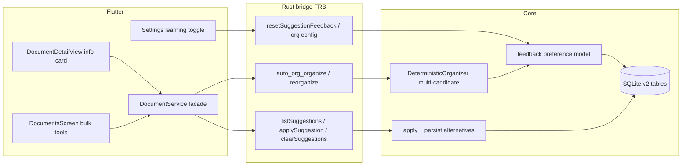

# Plan: Multi-suggestion review for titles/tags + feedback learning

## Goal

Remove the "ignore suggestions for manually edited tags/titles" behavior. Every suggestion
run (ingestion auto-org, bulk-suggest, per-document suggest buttons) keeps auto-applying its
**top** suggestion for non-manual documents **and** persists **all alternatives** as pending
suggestions shown in the document info card. The user can confirm the applied suggestion or
pick another; alternatives disappear once a choice is made. Every choice feeds a lightweight
on-device feedback model (per-term accept/reject stats) that re-ranks future suggestions.
Learning is controllable via a settings toggle (Off / Basic), with an Advanced classifier
reserved as a future phase.

## Confirmed decisions

- **Apply semantics**: keep auto-apply everywhere; also store alternatives; pending
  alternatives disappear after the user's review (confirmed or switched).
- **Learning**: feedback-weighted preference model (Basic) as default + `Off`/`Basic`
  settings toggle; Advanced online classifier is a reserved future phase (config slot only).
- All learning is on-device; no telemetry.

## Architecture overview



## Phase 1 — Storage (core)

**Files: [`core/src/storage/schema.rs`](core/src/storage/schema.rs),
[`core/src/storage/sqlite.rs`](core/src/storage/sqlite.rs),
[`core/src/api/storage.rs`](core/src/api/storage.rs)**

1. Migration v1 → v2 (append to `MIGRATIONS` in [`schema.rs`](core/src/storage/schema.rs:13)):

```sql
CREATE TABLE document_suggestions (
    id          TEXT PRIMARY KEY,            -- uuid
    document_id TEXT NOT NULL REFERENCES documents(id) ON DELETE CASCADE,
    kind        TEXT NOT NULL,               -- 'title' | 'tags'
    payload     TEXT NOT NULL,               -- suggested title text / JSON array of tags
    rank        INTEGER NOT NULL,            -- 0 = currently applied
    source      TEXT NOT NULL,               -- 'ingest' | 'bulk' | 'manual_request' | 'user'
    confidence  REAL NOT NULL DEFAULT 1.0,
    status      TEXT NOT NULL,               -- 'pending' | 'applied' | 'dismissed'
    created_at_ms INTEGER NOT NULL
);
CREATE INDEX idx_suggestions_doc ON document_suggestions(document_id, kind, status, rank);

CREATE TABLE suggestion_feedback (
    id          TEXT PRIMARY KEY,            -- uuid
    kind        TEXT NOT NULL,               -- 'title' | 'tags'
    context     TEXT NOT NULL,               -- 'title' | 'tag' | custom future context
    term        TEXT NOT NULL,               -- the tag or normalized title keyword
    action      TEXT NOT NULL,               -- 'accepted' | 'rejected'
    weight      REAL NOT NULL,               -- 1.0 model tap, 2.0 user-typed
    created_at_ms INTEGER NOT NULL
);
CREATE INDEX idx_feedback_term ON suggestion_feedback(kind, context, term);
```

2. `SqliteDocumentStore` methods: `put_suggestion`, `suggestions_for(doc_id)`,
   `replace_suggestions(doc_id, kind, list)` (marks old rows `dismissed`, inserts new),
   `mark_suggestion(id, status)`, `record_feedback(event)`, `feedback_stats(kind, context)`
   (aggregate accept/reject per term), `clear_feedback()`, `prune_suggestions(doc_id)`
   (delete non-pending rows older than N days, N=30 default).

3. Bridge surface on `DocumentRepository` in [`core/src/api/storage.rs`](core/src/api/storage.rs:164):
   thin pass-throughs so Dart can list/apply suggestions (mirrors existing `set_tags` style).

## Phase 2 — Feedback model (core)

**Files: new [`core/src/auto_org/feedback.rs`](core/src/auto_org/feedback.rs),
[`core/src/auto_org/config.rs`](core/src/auto_org/config.rs),
[`core/src/auto_org/mod.rs`](core/src/auto_org/mod.rs)**

1. `LearningMode { Off, Basic }` added to `OrgConfig` (serde camelCase; `Basic` default;
   `Advanced` deliberately NOT added yet — documented as future phase).
2. `PreferenceModel`: loads `feedback_stats` lazily, exposes:
   - `score(kind, term) -> f64`: `1 + alpha * accepts - beta * rejects`, EWMA-decayed
     (half-life ~90 days via `created_at_ms`), clamped `[0.25, 4.0]`.
   - `rerank_tags(candidates: Vec<(tag, weight)>)` and
     `rerank_titles(candidates: Vec<String>)`: stable sort by score desc; unknown terms
     score 1.0 (neutral cold start).
3. Recording: each accept/reject event is written at choice time (see Phase 4). A
   user-typed (not tapped-from-suggestions) tag/title keyword records `weight = 2.0`
   so self-authored metadata steers the model harder — the core "especially if user
   suggested his own title or tags" requirement.
4. Model is a pure function of the table: no caches to invalidate; `Off` mode simply
   stops recording and re-ranking (scores collapse to neutral).

## Phase 3 — Multi-candidate organizer (core)

**Files: [`core/src/auto_org/organizer.rs`](core/src/auto_org/organizer.rs:134),
[`core/src/auto_org/config.rs`](core/src/auto_org/config.rs:51),
[`core/src/auto_org/keywords.rs`](core/src/auto_org/keywords.rs)**

1. Extend `OrgPlan` (additive, non-breaking for FRB): `alt_titles: Vec<String>`,
   `alt_tag_sets: Vec<Vec<String>>` (ranked), keep `tags`/`suggested_title` as rank-0
   fields so existing consumers stay valid.
2. Title candidates (deduped, max 5): template title (current), top-keyword variants
   (`{kw1}-{kw2}`, `{kw1}-{kw2}-{kw3}`), raw-title-cleanup variant, generative tier when
   enabled. Re-rank with `PreferenceModel::rerank_titles` when `learning != Off`.
3. Tag candidates (max 5 sets): current k-NN+cluster set; k-NN-only set; cluster-only set;
   keyword set; a "conservative" set (top-3 by weight). Each set scored by summed
   preference-model term scores; sets ordered by that. Individual tags inside sets keep
   confidence order.
4. The organizer receives `&PreferenceModel` (built by the API layer from the repo) —
   organizer stays storage-agnostic (no direct SQLite dependency).

## Phase 4 — Apply + review semantics (core)

**Files: [`core/src/api/auto_org.rs`](core/src/api/auto_org.rs),
[`core/src/api/storage.rs`](core/src/api/storage.rs)**

1. **Remove the silent-skip semantics** in [`apply_plan`](core/src/api/auto_org.rs:82) and
   `auto_org_reorganize_one_impl`:
   - Non-manual doc: apply rank-0 title/tags as today **and** persist all alternatives
     (`status='pending'`, rank ≥ 1) for review in document info.
   - Manual-flag doc (`title_manual`/`tags_manual` truthy): DO NOT touch the applied value;
     persist **all** candidates (including the would-be rank 0) as `pending` so the user can
     still review and adopt. This replaces the old "unchanged (manually edited)" dead end.
2. Ingestion path [`organize_document`](core/src/api/auto_org.rs:153): same contract —
   auto-apply when not manual, always store alternatives for review.
3. New bridge functions (all `async` FRB, `&DocumentRepository` borrowed):
   - `list_suggestions(repo, documentId) -> Vec<SuggestionEntry>` (pending only, ranked).
   - `apply_suggestion(repo, documentId, suggestionId) -> ()`: applies via the normal
     `update_title`/`set_tags` paths (which already set manual flags — acceptable: a
     confirmed choice is a user edit), records feedback events (accepted terms + rejected
     rank-0 terms not in the chosen set), and marks the document's other pending
     suggestions `dismissed` (the "alternatives disappear after choice" contract).
   - `confirm_current(repo, documentId, kind) -> ()`: keeps the applied value; records
     `accepted` feedback for applied terms + `rejected` for the alternatives' distinctive
     terms; dismisses all pending of that kind.
   - `dismiss_suggestion(repo, suggestionId) -> ()` (swipe-away; records `rejected`).
   - `reset_suggestion_feedback(repo) -> ()` (settings "reset learning").
4. Feedback recording honors `LearningMode::Off` (no rows written).
5. Existing behavior preserved: `set_tags`/`update_title` keep writing manual flags;
   bulk passes keep honoring them for *applying* (now with review fallback per (1)).

## Phase 5 — FRB regeneration + Dart service layer

1. Run `just codegen` (["codegen" recipe](justfile:11)) — regenerates
   [`app/lib/src/rust/api/auto_org.dart`](app/lib/src/rust/api/auto_org.dart) and storage
   bindings from the new bridge surface.
2. [`app/lib/src/features/document_service.dart`](app/lib/src/features/document_service.dart):
   - New `SuggestionEntry` Dart type (id, kind, payload, rank, source, confidence).
   - `DocumentService` interface + `BridgeDocumentService`:
     `listSuggestions(id)`, `applySuggestion(id, suggestionId)`, `confirmCurrent(id, kind)`,
     `dismissSuggestion(suggestionId)`.
   - `FakeDocumentService` implements the same contract in-memory (stores a
     `Map<String, List<SuggestionEntry>>`), plus counters for tests. `suggestTitle` /
     `suggestTags` / `reorganizeOne` fakes now also populate pending suggestions for
     manually-edited docs instead of no-oping.
3. `DocerBulkOrganizer` unchanged (core still applies + stores alternatives internally).

## Phase 6 — Document info UI (Flutter)

**File: [`app/lib/src/ui/document_view.dart`](app/lib/src/ui/document_view.dart)**

1. `_suggestTitle` / `_suggestTags` rework: instead of snackbar-only outcomes, after the
   run reload pending suggestions; the title row and tags row show a compact
   "Suggestions" affordance (e.g. an overflow `Icons.lightbulb_outline` chip counter)
   when pending alternatives exist — including for manually-edited docs (no more silent
   "unchanged" snackbar; keep the snackbar as a transient hint only).
2. New `_SuggestionsSection` widget inside the metadata card, below title / below tags:
   - Rank-0 row (if pending): "Applied: …" with **Keep** (confirm) and **Switch** actions.
   - Alternatives as tappable chips: tap → inline confirm dialog (title: "Replace title?"
     / tags: "Replace tags?") → `applySuggestion` → section collapses, chips disappear.
   - Per-chip dismiss via long-press or trailing ✕ → `dismissSuggestion`.
   - Empty state (no pending): nothing rendered — zero clutter.
3. `_AddTagComposerDialog` unchanged; suggestion chips already route through `_addTag`.

## Phase 7 — Bulk + settings surfaces (Flutter)

**Files: [`app/lib/src/ui/documents_screen.dart`](app/lib/src/ui/documents_screen.dart:593),
settings screen (provider screen per [app.dart](app/lib/src/app.dart) wiring)**

1. `_runBulkSuggest` snackbar text updated: instead of implying manual docs were skipped,
   surface "N updated, M have suggestions to review" (core returns per-doc outcome; extend
   `suggestTitle`/`suggestTags` Dart service return to a small outcome record:
   `applied: bool, alternativesStored: int`).
2. Settings: learning mode dropdown (`Off` / `Basic — learn from my choices`) +
   "Reset learning data" button (confirm dialog) wired to `reset_suggestion_feedback`,
   and an informational caption that all data stays on-device. `OrgConfig` gains
   `learningMode`; the Dart side updates the stored config via the existing org-config
   bridge path (`autoOrgDefaultConfig` consumers switch to the persisted config store —
   follow the same persistence mechanism the provider screen uses).

## Phase 8 — Tests

**Rust** (mirror existing patterns in [`core/src/api/auto_org.rs` tests](core/src/api/auto_org.rs:431)
and [`core/src/storage/tests.rs`](core/src/storage/tests.rs)):

- Migration v2 applies cleanly, idempotent, tables exist (extend
  [`schema.rs` test](core/src/storage/schema.rs:101)).
- Storage CRUD: put/list/replace/mark suggestions; feedback stats aggregation; prune.
- Feedback model: neutral cold start; accepts boost, rejects demote; EWMA decay; clamp.
- Organizer: multi-candidate generation, dedup, max-5 caps, re-ranking with a seeded model.
- Apply semantics: non-manual doc → applied + pending alternatives stored; manual doc →
  applied value untouched + full candidate list pending (regression guard for the removed
  skip); `apply_suggestion` clears siblings + records feedback; `confirm_current` records
  both accept and reject events; `LearningMode::Off` records nothing.
- Bulk pass (`reorganize_all/selected`) stores alternatives instead of silently skipping.

**Flutter** (extend [`app/test/document_detail_test.dart`](app/test/document_detail_test.dart),
[`documents_browse_test.dart`](app/test/documents_browse_test.dart)):

- Suggestions section renders pending alternatives for a manual-flag document.
- Tapping an alternative calls `applySuggestion` and removes the section.
- Keep/confirm path calls `confirmCurrent`; dismiss path calls `dismissSuggestion`.
- Bulk-suggest outcome text reflects alternatives-stored.
- Fake service counters assert the new calls; no regressions in existing tests.

## Phase 9 — Verification

- `just fmt-core && just lint-core && just test-core`
- `just codegen` then `cd app && flutter analyze && flutter test`
- `just check` (repo-wide gate from the [justfile](justfile:4))

## Risks / notes

- **FRB churn**: new types + functions regenerate large parts of `frb_generated.*`;
  run codegen exactly once after the Rust bridge surface is complete to avoid drift.
- **Manual-flag semantics shift**: today flags mean "never touch"; new meaning is
  "auto-apply off, review suggestions instead". Flags are NOT removed — bulk apply still
  honors them — so sync/P2P payloads (documents carry `extra`) stay compatible.
- **Storage growth**: pending suggestions are pruned after 30 days / on choice;
  feedback table is bounded by distinct terms ever suggested (small).
- **Out of scope (future phase)**: Advanced online classifier behind the same
  `LearningMode` enum; P2P sync of feedback tables; per-path placement learning.
